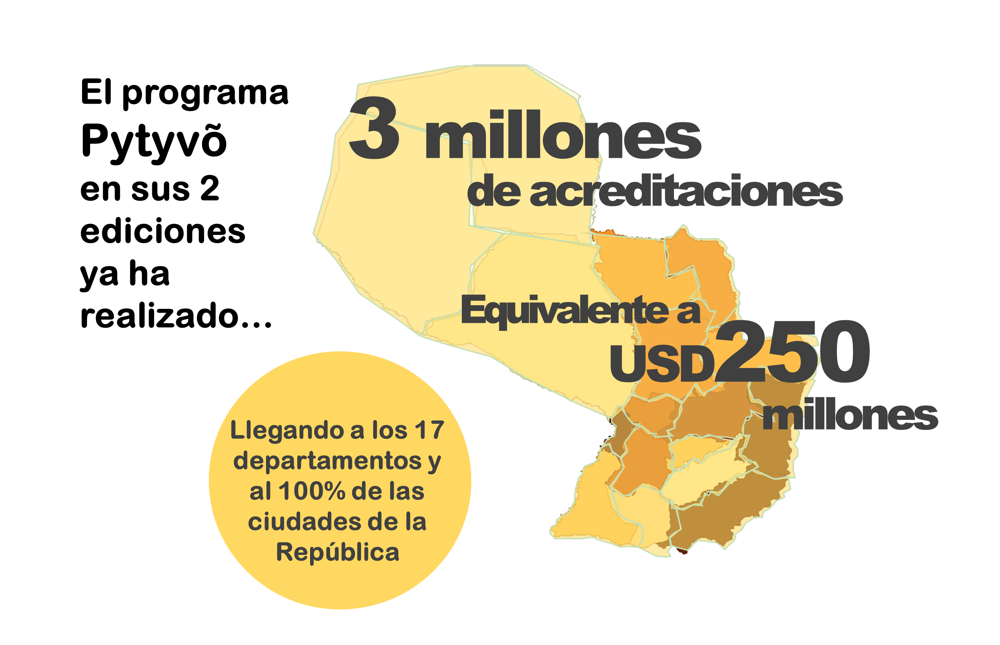

```{r setup, include=FALSE}
library(flexdashboard)
library(shiny)
library(tidyverse)
library(plotly)
library(ggplot2)
library(sf)
library(readxl)
library(leaflet)
library(tidyr)
library(maps)
library(sp)
library(rgdal)
library(htmlwidgets)
library(wakefield)
library(rmapshaper)

#rm(list=ls())
```

```{r general setup, include = FALSE}

# Load data
merged_dpto_benef <- readOGR("merged_dpto_benef2.shp", 
                              use_iconv = T, encoding = "UTF-8")
merged_dist_benef <- readOGR("merged_dist_benef2.shp", 
                             use_iconv = T, encoding = "UTF-8")
merged_dpto <- readOGR("merged_dpto2.shp", 
                       use_iconv = T, encoding = "UTF-8")
merged_dist <- readOGR("merged_dist2.shp", 
                       use_iconv = T, encoding = "UTF-8")

```

Resumen General {data-icon="fa-chart-pie"}
=============================

Column {data-width=400}
-----------------------------------------------------------------------

### personas beneficiadas

```{r 1}
Beneficiarios <- "763.761"
valueBox(Beneficiarios, icon = "fa-user-friends")
```


### **Beneficiarios por sexo**

```{r sexo}

Sexo_sample <- read_excel("Sexo.xlsx")

labels_sex <- c("Femenino", "Masculino")

#        type = 'bar',
 #       text = paste(Edad_sample$Percentage),
  #      hoverinfo = 'x+text') %>%

plot_ly(Sexo_sample, labels= labels_sex, values = ~cantidad,
        insidetextfont = list(size = 20),
        showlegend = T) %>%
  add_pie(hole = 0.6) %>%
  layout(separators = ',.',
         xaxis = list(showgrid = F, zeroline = F, showticklabels = F),
         yaxis = list(showgrid = F, zeroline = F, showticklabels = F)) %>% 
  layout(legend= list(orientation="v", font=(list(size=12))),
         xaxis = list(showgrid = F, zeroline = F, showticklabels = F),
         yaxis = list(showgrid = F, zeroline = F, showticklabels = F),
         margin = list(l = 20, r = 20, b = 10, t = 10, pad = 0)) %>%
  config(locale = "es")

```

### **Comercios por EMPES utilizadas**

```{r empes}

EMPES <- read_excel("EMPES.xlsx")

EMPES %>%
  knitr::kable(col.names = c("EMPE", "Cantidad de Comercios"), height = 3)

```


Column {data-width=400}
-----------------------------------------------------------------------

### millones de dólares en consumo

```{r 2}
consumo <- "42,4"
valueBox(consumo, icon = "fa-dollar-sign")
```


### **Beneficiarios por edad**

```{r edad}

Edad_sample <- read_excel("Edad.xlsx")

Edad_sample$`Rango de Edad` <- as.factor(Edad_sample$`Rango de Edad`)

Edad_sample$`Rango de Edad` <- ordered(
  x = Edad_sample$`Rango de Edad`, levels = c("Menor de 20", "20-24",
                                              "25-29", "30-34", "35-39",
                                              "40-44", "45-49", "50-54",
                                              "55-59", "60-65", "Mayor de 65"))

plot_ly(Edad_sample,
        x = ~`Rango de Edad`,
        y = ~Cantidad,
        type = 'bar',
        text = paste(Edad_sample$Percentage),
        hoverinfo = 'x+text') %>%
  layout(xaxis = list(title = "Edad",
                      showticklabels = F,
                      automargin = T,
                      titlefont = list(size = 12)),
         yaxis = list(title = "Cantidad",
                      titlefont = list(size = 12)),
         margin = list(l = 20, r = 20, b = 10, t = 10, pad = 0)) %>%
  config(locale = "es")

```

### **Consumpo por tipo de Comercio**

```{r comercios}
Comercios <- read_excel("Comercios_final.xlsx")

Comercios$RUBRO <- ordered(
  x = Comercios$RUBRO, levels = c("Farmacias",
                                  "Despensas y Supermercados",
                                  "Otros"))

#plot_ly(Comercios, x = ~RUBRO, y = ~cant, type = 'bar',
#        orientation = 'v',
#        text = paste(Comercios$Percentage),
#        hoverinfo = 'x+text',
#        marker = list(color = 'rgb(158,202,225)',
#                      line = list(color = 'rgb(8,48,107)',
#                                  width = 1.5))) %>% 
#  layout(separators = ',.',
#         xaxis = list(title = "Tipo de Comercio",
#                      showticklabels = F,
#                      titlefont = list(size = 12)),
#         yaxis = list(title = "Consumo en USD",
#                      showticklabels = T,
#                      titlefont = list(size = 12)),
#         margin = list(l = 20, r = 20, b = 20, t = 30, pad = 0)) %>%
#  config(locale = "es")

#plot_ly(Comercios, labels= ~RUBRO, values = ~cant,
#        insidetextfont = list(size = 20),
#        textinfo = 'none',
#        text = c("Farmacias: 2,2%", "Otros: 6,7%",
#                 "Despensas y Supermercados: 91,1%"),
#        hoverinfo = 'text',
#        showlegend = F) %>%
#  add_pie(hole = 0.6) %>%
#  layout(separators = ',.',
#         xaxis = list(showgrid = F, zeroline = F, showticklabels = F),
#         yaxis = list(showgrid = F, zeroline = F, showticklabels = F)) %>% 
#  layout(legend= list(orientation="v", font=(list(size=12))),
#         xaxis = list(showgrid = F, zeroline = F, showticklabels = F),
#         yaxis = list(showgrid = F, zeroline = F, showticklabels = F),
#         margin = list(l = 10, r = 10, b = 10, t = 10, pad = 0)) %>%
#  config(locale = "es")

plot_ly(Comercios, labels= c("Farmacias", "Otros", "Supermercados"), 
        values = ~cant,
        insidetextfont = list(size = 20),
        textinfo = 'none',
        text = c("Farmacias: USD 0,9M (2,2%)", "Otros: USD 2,8M (6,7%)",
                 "Despensas y Supermercados: USD 38,7M (91,1%)"),
        hoverinfo = 'text',
        showlegend = T) %>%
  add_pie(hole = 0.6) %>%
  layout(separators = ',.',
         xaxis = list(showgrid = F, zeroline = F, showticklabels = F),
         yaxis = list(showgrid = F, zeroline = F, showticklabels = F)) %>% 
  layout(legend= list(orientation="v", font=(list(size=12))),
         xaxis = list(showgrid = F, zeroline = F, showticklabels = F),
         yaxis = list(showgrid = F, zeroline = F, showticklabels = F),
         margin = list(l = 20, r = 20, b = 10, t = 10, pad = 0)) %>%
  config(locale = "es")

```


Column {data-width=200}{.tabset .tabset-fade} 
-----------------------------------------------------------------------


### **Cantidad de Beneficiarios**

```{r benef_map}

# DEPARTAMENTOS

# intervals for distribution
bins_dpto_benef <- c(1500, 12000, 30000, 50000, 90000, 120000, 350000)


# color palettes
pal_dpto_benef <- colorBin(palette = "Blues",
                domain = merged_dpto_benef$BENEF, 
                bins = bins_dpto_benef, reverse = F)

# html code for label popup
labels_dpto_benef <- sprintf(
  "<strong>Departamento:</strong> %s <br><strong>Nro. total de beneficiarios:</strong> %s",
  merged_dpto_benef$DPTO_DESC, 
  prettyNum(merged_dpto_benef$BENEF, big.mark = ".")) %>%
  lapply(htmltools::HTML)

# Leaflet Map
mapa_benef1 <- leaflet(merged_dpto_benef) %>%
  addProviderTiles(provider = "CartoDB.Positron") %>%
  addPolygons(
    fillColor = ~ pal_dpto_benef(BENEF),
    weight = 0.5,
    opacity = 1,
    color = "#3b3e45",
    dashArray = "",
    fillOpacity = 0.9,
    highlight = highlightOptions(
      weight = 2,
      color = "#666",
      dashArray = "",
      fillOpacity = 0.5,
      bringToFront = T),
    label = labels_dpto_benef,
    labelOptions = labelOptions(
      style = list("font-weight" = "normal", padding = "3px 8px"),
      textsize = "12px",
      direction = "auto")) %>%
  addLegend("topright",
            pal = pal_dpto_benef, 
            values = ~ BENEF,
            title = "Nro. de beneficiarios",
            opacity = 0.7,
            labFormat = labelFormat(big.mark = ".")) %>%
  addScaleBar("bottomleft", options =
                scaleBarOptions(imperial = T, updateWhenIdle = T))


# DISTRITOS

# intervals for distribution
bins_dist_benef <- c(0, 300, 800, 3000, 15000, 50000, 120000)


# color palettes
pal_dist_benef <- colorBin(palette = "Blues",
                domain = merged_dist_benef$cantidad, 
                bins = bins_dist_benef, reverse = F)

# html code for label popup
labels_dist_benef <- sprintf(
  "<strong>Distrito:</strong> %s <br><strong>Nro. total de beneficiarios:</strong> %s",
  merged_dist_benef$DIST_DESC, 
  prettyNum(merged_dist_benef$cantidad, big.mark = ".")) %>%
  lapply(htmltools::HTML)


# Leaflet Map
mapa_benef2 <- leaflet(merged_dist_benef) %>%
  addProviderTiles(provider = "CartoDB.Positron") %>%
  addPolygons(
    fillColor = ~ pal_dist_benef(cantidad),
    weight = 0.5,
    opacity = 1,
    color = "#3b3e45",
    dashArray = "",
    fillOpacity = 0.9,
    highlight = highlightOptions(
      weight = 2,
      color = "#666",
      dashArray = "",
      fillOpacity = 0.5,
      bringToFront = T),
    label = labels_dist_benef,
    labelOptions = labelOptions(
      style = list("font-weight" = "normal", padding = "3px 8px"),
      textsize = "12px",
      direction = "auto")) %>%
  addLegend("topright",
            pal = pal_dist_benef, 
            values = ~ cantidad,
            title = "Nro. de beneficiarios",
            opacity = 0.7,
            labFormat = labelFormat(big.mark = ".")) %>%
  addScaleBar("bottomleft", options =
                scaleBarOptions(imperial = T, updateWhenIdle = T))

# Shiny code

ui <- fluidPage(
      radioButtons(inputId = "mapbenef",
                   label = "Seleccione",
                            c("Por Departamento" = "dept",
                              "Por Distrito" = "dist"),
                   inline = T),
      leafletOutput("mapabenef", height = 450))

server <- function(input, output) {
  output$mapabenef <- renderLeaflet({
    mapbenef <- switch (input$mapbenef,
                        dept = mapa_benef1,
                        dist = mapa_benef2,
                        mapa_benef1)
  })
  }

shinyApp(ui = ui, server = server)

```


### **Consumo en Comercios**

```{r cons_map, warning = FALSE, message = FALSE}

# DEPARTAMENTOS

# intervals for distribution
bins_dpto <- c(0, 500, 1000, 5000, 8000, 10000, 13000)

# color palettes
pal_dpto <- colorBin(palette = "YlOrBr",
                domain = merged_dpto$TOTAL, 
                bins = bins_dpto, reverse = F)

# html code for label popup
labels_dpto <- sprintf(
  "<strong>Distrito:</strong> %s <br><strong>Consumo total en miles de USD:</strong> %g",
  merged_dpto$DPTO_DESC, merged_dpto$TOTAL) %>%
  lapply(htmltools::HTML)

# Leaflet Map
mapa1 <- leaflet(merged_dpto) %>%
  addProviderTiles(provider = "CartoDB.Positron") %>%
  addPolygons(
    fillColor = ~ pal_dpto(TOTAL),
    weight = 0.5,
    opacity = 1,
    color = "#3b3e45",
    dashArray = "",
    fillOpacity = 0.9,
    highlight = highlightOptions(
      weight = 2,
      color = "#666",
      dashArray = "",
      fillOpacity = 0.5,
      bringToFront = T),
    label = labels_dpto,
    labelOptions = labelOptions(
      style = list("font-weight" = "normal", padding = "3px 8px"),
      textsize = "12px",
      direction = "auto")) %>%
  addLegend("topright",
            pal = pal_dpto, 
            values = ~ TOTAL,
            title = "Consumo en miles de USD",
            opacity = 0.7,
            labFormat = labelFormat(big.mark = ".")) %>%
  addScaleBar("bottomleft", options =
                scaleBarOptions(imperial = T, updateWhenIdle = T))

# DISTRITOS

# intervals for distribution
bins_dist <- c(0, 15, 35, 65, 160, 500, 4500)

# color palettes
pal_dist <- colorBin(palette = "YlOrBr",
                domain = merged_dist$TOTAL, 
                bins = bins_dist, reverse = F)

# html code for label popup
labels_dist <- sprintf(
  "<strong>Distrito:</strong> %s <br><strong>Consumo total en miles de USD:</strong> %g",
  merged_dist$DIST_DESC, merged_dist$TOTAL) %>%
  lapply(htmltools::HTML)

# Leaflet Map
mapa2 <- leaflet(merged_dist) %>%
  addProviderTiles(provider = "CartoDB.Positron") %>%
  addPolygons(
    fillColor = ~ pal_dist(TOTAL),
    weight = 0.5,
    opacity = 1,
    color = "#3b3e45",
    dashArray = "",
    fillOpacity = 0.9,
    highlight = highlightOptions(
      weight = 2,
      color = "#666",
      dashArray = "",
      fillOpacity = 0.5,
      bringToFront = T),
    label = labels_dist,
    labelOptions = labelOptions(
      style = list("font-weight" = "normal", padding = "3px 8px"),
      textsize = "12px",
      direction = "auto")) %>%
  addLegend("topright",
            pal = pal_dist, 
            values = ~ TOTAL,
            title = "Consumo en miles de USD",
            opacity = 0.7,
            labFormat = labelFormat(big.mark = ".")) %>%
  addScaleBar("bottomleft", options =
                scaleBarOptions(imperial = T, updateWhenIdle = T))

  

# Shiny code

ui <- fluidPage(
      radioButtons(inputId = "map1",
                   label = "Seleccione",
                            c("Por Departamento" = "dept",
                              "Por Distrito" = "dist"),
                   inline = T),
      leafletOutput("mapa1", height = 450))

server <- function(input, output) {
  output$mapa1 <- renderLeaflet({
    map1 <- switch (input$map1,
                    dept = mapa1,
                    dist = mapa2,
                    mapa1)
  })
  }

shinyApp(ui = ui, server = server)

```


Sobre el Programa {data-orientation=rows data-icon="fa-question"}
=============================

Row {data-width=150}
-----------------------------------------------------------------------

### de acreditaciones en Pytyvõ 1

```{r pytyvo1}
Acreditados <- "2,3 millones"
valueBox(Acreditados, icon = "fa-money-bill-wave", 
         color = "#ffda73")
```

### acreditaciones en Pytyvõ 2

```{r Pytyvo 2}
Acreditados2 <- "763mil"
valueBox(Acreditados2, icon = "fa-money-bill-wave",
         color = "#ffda73")
```

### acreditaciones

```{r Total}
Acreditados3 <- "Total: 3.064.411"
valueBox(Acreditados3, icon = "fa-users",
         color = "#ffda73")
```


Row {data-width=400}
-----------------------------------------------------------------------

### **Alcance del Programa**




### **El Programa**


<font size="4"> 


El programa Pytyvõ fue creado para asistir a trabajadores informales, priorizando a quienes cuentan con bajos niveles de ingresos y quienes se han visto afectados por la pandemia.

En sus dos ediciones, el programa ya ha generado más de 3 millones de acreditaciones en todo el país. A través de Pytyvõ 2.0. se han priorizado a los trabajadores residentes en zonas fronterizas.
</font>


<style type="text/css">

.chart-title {  /* chart_title  */
   font-size: 15px;
   font-family: Arial;

</style>


