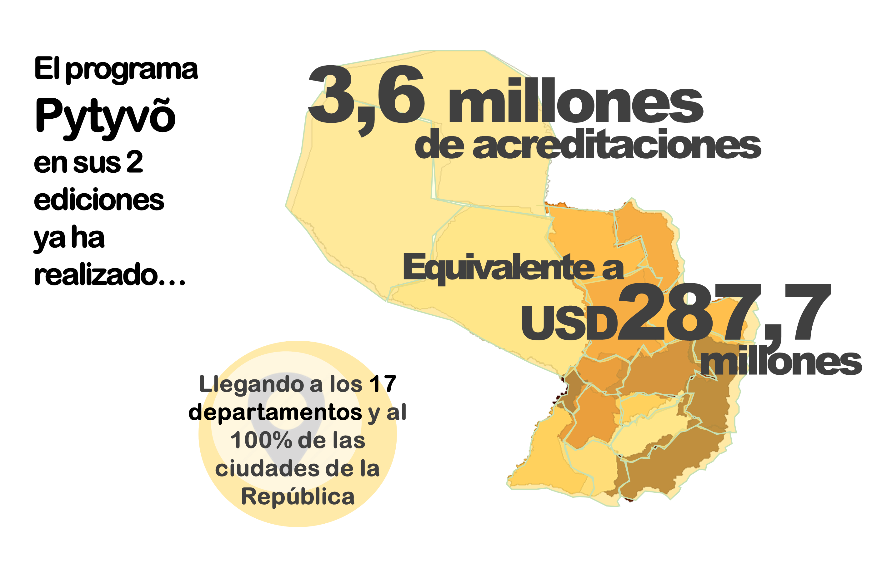

```{r setup, include=FALSE}
library(flexdashboard)
library(shiny)
library(tidyverse)
library(plotly)
library(ggplot2)
library(sf)
library(readxl)
library(leaflet)
library(tidyr)
library(maps)
library(sp)
library(rgdal)
library(htmlwidgets)
library(wakefield)
library(rmapshaper)

#rm(list=ls())
```

```{r general setup, include = FALSE}

# Load data
merged_dpto_benef <- readOGR("merged_dpto_benef2.shp", 
                              use_iconv = T, encoding = "UTF-8")
```

Resumen General {data-icon="fa-chart-pie"}
=============================

Column {data-width=400}
-----------------------------------------------------------------------

### acreditaciones

```{r 1}
Beneficiarios <- "1.322.959"
valueBox(Beneficiarios, icon = "fa-user-friends")
```


### **Beneficiarios por sexo**

```{r sexo}

Sexo_sample <- read_excel("Sexo.xlsx")

labels_sex <- c("Femenino", "Masculino")

plot_ly(Sexo_sample, labels= labels_sex, values = ~cantidad,
        insidetextfont = list(size = 20),
        showlegend = T,
        hoverinfo = 'percent') %>%
  add_pie(hole = 0.6) %>%
  layout(separators = ',.',
         xaxis = list(showgrid = F, zeroline = F, showticklabels = F),
         yaxis = list(showgrid = F, zeroline = F, showticklabels = F)) %>% 
  layout(legend= list(orientation="v", font=(list(size=12))),
         xaxis = list(showgrid = F, zeroline = F, showticklabels = F),
         yaxis = list(showgrid = F, zeroline = F, showticklabels = F),
         margin = list(l = 20, r = 20, b = 10, t = 10, pad = 0)) %>%
  config(locale = "es",
         displayModeBar = F)

```

### **Beneficiarios por edad**

```{r edad}

Edad_sample <- read_excel("Edad.xlsx")

Edad_sample$`Rango de Edad` <- as.factor(Edad_sample$`Rango de Edad`)

Edad_sample$`Rango de Edad` <- ordered(
  x = Edad_sample$`Rango de Edad`, levels = c("Menor de 20", "20-24",
                                              "25-29", "30-34", "35-39",
                                              "40-44", "45-49", "50-54",
                                              "55-59", "60-65", "Mayor de 65"))

plot_ly(Edad_sample,
        x = ~`Rango de Edad`,
        y = ~Cantidad,
        type = 'bar',
        text = paste(Edad_sample$Percentage),
        hoverinfo = 'x+text') %>%
  layout(xaxis = list(title = "Edad",
                      showticklabels = F,
                      automargin = T,
                      titlefont = list(size = 12)),
         yaxis = list(title = "Cantidad",
                      titlefont = list(size = 12)),
         margin = list(l = 10, r = 10, b = 10, t = 10, pad = 0)) %>%
  config(locale = "es",
         displayModeBar = F)

```

Column {data-width=400}
-----------------------------------------------------------------------

### millones de dólares inyectados

```{r 2}
consumo <- "95,2"
valueBox(consumo, icon = "fa-dollar-sign")
```


### **20 ciudades con mayor nivel de acreditación**

```{r ciudades}

Ciudades <- read_excel("Ciudades_acred.xlsx")

Ciudades$Ciudades <- factor(Ciudades$Ciudades, 
                               levels = unique(Ciudades$Ciudades)[
                                 order(Ciudades$Cant, decreasing = F)
                               ])

plot_ly(Ciudades,
        x = ~Cant,
        y = ~Ciudades,
        type = 'bar',
        orientation = 'h',
        text = paste(Ciudades$miles),
        hoverinfo = 'text') %>%
  layout(separators = ',.',
         xaxis = list(title = "Acreditaciones",
                      showticklabels = T,
                      automargin = T,
                      titlefont = list(size = 12)),
         yaxis = list(title = "",
                      titlefont = list(size = 12)),
         margin = list(l = 10, r = 10, b = 10, t = 10, pad = 5)) %>%
  config(locale = "es",
         displayModeBar = F)

```


Column {data-width=500}
-----------------------------------------------------------------------


### **Cantidad de Beneficiarios por Departamento**

```{r benef_map}

# DEPARTAMENTOS

# intervals for distribution
bins_dpto_benef <- c(1500, 12000, 30000, 50000, 90000, 120000, 350000)


# color palettes
pal_dpto_benef <- colorBin(palette = "Blues",
                domain = merged_dpto_benef$BENEF, 
                bins = bins_dpto_benef, reverse = F)

# html code for label popup
labels_dpto_benef <- sprintf(
  "<strong>Departamento:</strong> %s <br><strong>Nro. total de beneficiarios:</strong> %s",
  merged_dpto_benef$DPTO_DESC, 
  prettyNum(merged_dpto_benef$BENEF, big.mark = ".")) %>%
  lapply(htmltools::HTML)

# Leaflet Map
leaflet(merged_dpto_benef) %>%
  addProviderTiles(provider = "CartoDB.Positron") %>%
  addPolygons(
    fillColor = ~ pal_dpto_benef(BENEF),
    weight = 0.5,
    opacity = 1,
    color = "#3b3e45",
    dashArray = "",
    fillOpacity = 0.9,
    highlight = highlightOptions(
      weight = 2,
      color = "#666",
      dashArray = "",
      fillOpacity = 0.5,
      bringToFront = T),
    label = labels_dpto_benef,
    labelOptions = labelOptions(
      style = list("font-weight" = "normal", padding = "3px 8px"),
      textsize = "12px",
      direction = "auto")) %>%
  addLegend("topright",
            pal = pal_dpto_benef, 
            values = ~ BENEF,
            title = "Nro. de beneficiarios",
            opacity = 0.7,
            labFormat = labelFormat(big.mark = ".")) %>%
  addScaleBar("bottomleft", options =
                scaleBarOptions(imperial = T, updateWhenIdle = T))

```


Sobre el Programa {data-orientation=rows data-icon="fa-question"}
=============================

Row {data-width=150}
-----------------------------------------------------------------------

### de acreditaciones en Pytyvõ 1

```{r pytyvo1}
Acreditados <- "2,3 millones"
valueBox(Acreditados, icon = "fa-money-bill-wave", 
         color = "#ffda73")
```

### de acreditaciones en Pytyvõ 2

```{r Pytyvo 2}
Acreditados2 <- "1,3 millones"
valueBox(Acreditados2, icon = "fa-money-bill-wave",
         color = "#ffda73")
```

### acreditaciones en total

```{r Total}
Acreditados3 <- "Total: 3.623.609"
valueBox(Acreditados3, icon = "fa-users",
         color = "#ffda73")
```


Row {data-width=400}
-----------------------------------------------------------------------

### **Alcance del Programa**




### **El Programa**


<font size="4"> 


El programa Pytyvõ fue creado para asistir a trabajadores informales priorizando cuentan con bajos niveles de ingresos y para quienes se han visto afectados por la pandemia en general.

El programa en sus dos ediciones ya ha generado más de 3,6 millones de acreditaciones en todo el país y en esta segunda edición del programa. Pytyvõ 2.0. se han priorizado a los trabajadores residentes en zonas fronterizas.
</font>


<style type="text/css">

.chart-title {  /* chart_title  */
   font-size: 15px;
   font-family: Arial;

</style>


